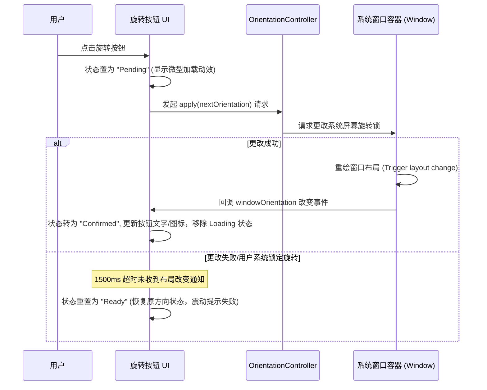

# LapSight 驾驶准备页与赛道中心 UX 提案

本提案旨在对 LapSight 的驾驶准备页（Drive Prep）、赛道中心（Track Center）及 Session Review 进行深度 UX 重塑。设计立足于**专业车载 timing 仪器**的定位，优先解决卡丁车、赛车和自行车等高速、强震动、高反光物理环境下的用户摩擦，打造极致 glanceable、高稳定性的视觉与交互层级。

---

## 1. 核心设计原则

在时速超过 100 km/h、伴随剧烈颠簸与强光反射的驾驶舱内，任何多余的视觉干扰或复杂的点击操作都是极其危险的。本方案遵循以下三大核心设计原则：

*   **一眼即达性 (Glanceability)**
    *   **3米可读性**：关键状态（如 GPS 精度、眼镜连接、开始/停止状态）必须通过强烈的色彩编码（Color Coding）和色块大小来传递，即使在余光中也能被感知，无需用户费神阅读小字。
    *   **信息降噪**：界面绝不包含任何与“准备驾驶”无关的社交分享、推荐或探索内容。
*   **大拇指黄金触控区 (Thumb-Zone Optimization)**
    *   所有赛前配置和触发按键（如“开始计时”、“旋转屏幕”、“标记/选择赛道”）均集中于屏幕下半部的 1/3 区域，确保用户戴着专业赛车手套时依然可以单手轻松盲操。
*   **视觉稳定性与可预测性 (Visual Stability & Predictability)**
    *   **零布局抖动**：状态切换（如 GPS 信号从差变好）仅改变原有组件的颜色、图标和文字内容，绝不导致按钮位置发生像素级位移或整体布局重排，以防止运动中误触。
    *   **异步操作真实反馈**：对于旋转屏幕等依赖系统容器响应的操作，不作任何“伪装”动画，交互状态必须由底层容器的实际物理变化触发更新。

---

## 2. 驾驶准备页（Drive Prep）逐区布局

驾驶准备页仅负责**计时前的配置与状态确认**。一旦按下“开始计时”，页面将通过无缝的渐隐转场，完全被“全屏计时页”替代。

```
+------------------------------------------+
|  [Track Select: 锐思赛车场 - 外环布局 V1.2] | <- 顶部独立赛道选择横条 (赛道中心明确入口)
+------------------------------------------+
|                                          |
|                                          |
|            [ 本 地 地 图 ]                | <- 中部小范围本地雷达地图 (~300m 缩放)
|         - 仅显示当前位置与精度圈            | - 显示已选赛道轮廓与起终点线 (如有)
|         - 无任何赛道图钉/大段空状态          | - 自动匹配周边底图
|                                          |
|                                          |
+------------------------------------------+
|      [GPS Status: 良好 (1.2m / 10Hz)]     | <- GPS 信号状态卡片 (大色块指示)
+------------------------------------------+
|  [ Glasses Ready ]                       | <- 眼镜连接状态小药丸 (仅配对后显示)
+------------------------------------------+
|                                          |
|         [  S T A R T   T I M I N G  ]    | <- 底部超大高对比度计时开始按钮
|                                          |
+------------------------------------------+
```

### 2.1 顶部：赛道选择名片横条
*   **视觉特征**：采用深灰背景（`MaterialTheme.colorScheme.surfaceVariant`），四周留有 1px 细线边框，左侧放置赛道 icon，中部显示“赛道名称 + 布局 + 稳定版本号”（例如：`锐思赛车场 · 外环布局 v1.2`），右侧放置一个精美的微缩箭头提示。
*   **交互逻辑**：整个横条是赛道中心的明确入口。点击后触发共享元素转场（Shared Element Transition），赛道名称和边框平滑展开为全屏赛道中心。

### 2.2 中部：本地雷达地图 (Local Radar Map)
*   **显示范围**：固定为 200米 - 500米 的超近范围。
*   **内容限制**：
    1.  **用户当前定位**：地图中心为高对比度的蓝色定位波纹。定位圈的外围发散淡蓝色的“定位精度（Accuracy）阴影半透明圆环”。
    2.  **已选赛道轮廓**：如果已选定赛道，地图上以亮蓝色的粗线条（带箭头指示方向）渲染赛道轮廓，并在对应坐标上标出绿色的“起终点线”和红色的“分段计时线”。
    3.  **周边底图**：预留底图接口，不显示任何社交图钉、附近发现、赛道评测、标记新起点等噪音。
*   **无空状态设计**：未选择赛道时，地图依旧显示用户的本地位置及定位精度，禁止弹出“未选择赛道/请点击标记新赛道”等遮挡地图的大段空状态弹窗。

### 2.3 下部：状态监控与操作区
*   **GPS 状态指示**：位于地图正下方。若定位精度较差，以黄色/红色高对比度字样提示“GPS 预热中”；精度达标（根据 ReadyGate 设定的 25m 精度、15s 刷新率、0.9Hz 采样率阈值）后，转为沉静的绿色。
*   **眼镜状态小药丸**：若用户未曾在设置中配对过眼镜，此组件完全隐藏。若已配对，则会在开始按钮上方浮现一个小药丸，点击可循环切换 HUD 的投屏页面（Focused/Delta/Speed）。
*   **开始按钮**：屏幕底部的全宽（Full-width）、圆角、超大高对比度 Action Button。只有在 GPS ReadyGate 和赛道选择均已通过时才转为高亮激活态。

---

## 3. 核心状态流转与交互逻辑

### 3.1 状态 A：未选择赛道 (No Track Selected)
*   **地图表现**：地图仅渲染当前用户的定位点。定位点有轻微的呼吸动效，底图无赛道路径轮廓。
*   **顶部横条**：显示文字 `请选择赛道`，并有微妙的闪烁呼吸光晕（Breathing Glow），引导用户点击。
*   **开始按钮**：处于不可点击的置灰状态。若用户强行点击，在按钮上方弹出 transient toast（浮动提示）：“请先选择赛道”。

### 3.2 状态 B：已选择赛道 (Track Selected)
*   **地图表现**：地图自动缩放并旋转（Course-Up 模式），将用户当前位置与已选择赛道的“起终点线”同时收纳在可视范围内。赛道粗线以亮蓝色显示，起终点线以绿色粗横条标记。
*   **顶部横条**：完整显示 `赛道名称 · 布局版本号`（例如：`天马赛车场 · 标准逆时针 v2.1`）。
*   **方向/布局微调**：在顶部横条下方，动态展开方向切换（顺时针/逆时针）和拓扑结构（闭环/点对点）的 Segmented Control，方便用户作赛前最后校对。
*   **开始按钮**：若 GPS 精度满足 ReadyGate 阈值，按钮转为高亮主色（`MaterialTheme.colorScheme.primary`），大字显示 `START TIMING`。

### 3.3 状态 C：已配对眼镜 (Glasses Connected / Casting)
*   **眼镜控制动态装载**：在“开始计时”按钮上方动态插入 Glasses HUD 投屏控制器。
*   **状态展示**：
    *   **未连接**：小药丸显示 `🕶️ 眼镜未连接`（灰字，点击可触发静默重连）。
    *   **已连接**：小药丸显示 `🕶️ HUD 已就绪 (FOCUSED)`（绿色亮字），右侧带有一个 HUD 页面循环切换按钮，使用户可以直接同步 glasses 上的显示模式。

---

## 4. 全屏赛道中心信息架构 (Track Center)

赛道中心是一个**完全去地图化、全列表呈现**的赛道信息管理中枢，支持快速的检索与版本控制。

```
+------------------------------------------+
|  [<- 返回]        赛 道 中 心             [关闭] |
+------------------------------------------+
|  [ 🔍 搜索本地与云端公共赛道库...         ] | <- 数据库搜索栏 (手动后备)
+------------------------------------------+
|                                          |
|  最近使用 (Recently Used)                 |
|  +------------------+  +--------------+  |
|  | 上海天马赛车场    |  | 北京锐思     |  | <- 横向滑动卡片 (最多3个)
|  | v2.1 | 45.2s 最佳 |  | v1.2 | 1m5.2s |  |
|  +------------------+  +--------------+  |
|                                          |
|  附近赛道 (Nearby Tracks)                 |
|  * 距您 1.2 km                            |
|  上海天马赛车场 (标准逆时针)           v2.1 | <- 纵向列表 (按距离排序)
|  * 距您 18.5 km                           |
|  上海国际赛车场 (GP布局)               v4.0 |
|                                          |
+------------------------------------------+
|  [ ＋ 标记新赛道 (自定义) ]               | <- 新建自定义入口 (底部次级按钮)
+------------------------------------------+
```

### 4.1 信息层级规划
1.  **顶部导航**：左侧提供返回，右侧提供关闭。下方放置大面积文本输入框：`🔍 搜索本地与云端公共赛道库...`。
2.  **“最近使用”区域（横滑卡片）**：
    *   卡片包含：赛道名称、布局版本、用户在此布局的个人历史最佳圈速（PB）、最后一次使用时间。
3.  **“附近赛道”区域（纵向列表，按距离排序）**：
    *   列表中仅展示距离用户当前位置 100 km 以内的赛道。
    *   列表项包含：赛道名称、布局描述、方向指示器、当前物理距离、起终点线坐标简码。
    *   **微缩矢量轮廓图 (Mini-Circuit Outline)**：每一个列表项的右侧渲染一个微型赛道线条图，帮助用户通过视觉轮廓进行瞬时辨识。
4.  **新建入口（次级入口）**：
    *   纵向滑动的最底部（或者界面底部悬浮）放置一个次级视觉强度的边框按钮：`＋ 标记新赛道`。这引导用户使用 LocationProvider 录制并标记自定义起点。

---

## 5. 自定义赛道新建与搜索流程细节

### 5.1 搜索流程（本地缓存优先，云端后备）
*   **本地快速搜索**：当用户在搜索框输入文字时，LapSight 优先在本地的 SQLite 数据库/文件缓存中进行拼音/模糊匹配。
*   **公共赛道库匹配**：本地无匹配时，静默向公共赛道库（标准赛道 API）发起请求。搜索结果清晰标出“公共标准库”或“我的自定义”标签，防止命名混淆。

### 5.2 自定义赛道创建流程 (Marking / Custom Track Flow)
1.  **新建 preflight**：点击 `标记新赛道`，进入拓扑类型选择（闭环/点对点）。
2.  **录制轨迹**：用户点击 `开始记录` 并开行/骑行一圈。此时界面展示 `MarkingTracePane`，显示轨迹点。
3.  **提取起终点与版本生成**：
    *   完成一圈后点击 `停止记录`，系统调用 `ReferenceLineExtractor` 提取参考线。
    *   系统通过 `StartFinishRecommender` 自动推荐起终点线。用户可以通过进度滑块（Progress Slider）在参考线轨迹上平滑拖动微调起终点线位置。
    *   **生成 CourseCompatibilityKey**：自定义赛道保存时，自动计算几何特征指纹，并在本地打上版本戳（例如：`MyPrivateTrack_v1.0`）。

---

## 6. Review 模块的数据隔离与调整

为消除 Review 与赛道管理之间的职责重叠，Review 模块应进行彻底去赛道化的**数据隔离**：

*   **Review Tab 职责单一化**：
    *   **移除赛道卡片**：Review 列表中不再展示“Tracks”与“Archived Tracks”卡片。Review 主视图仅保留以**时间戳**或**日期**排序的“计时 Session (Timing Session)”和“原始轨迹记录 (Raw Captures)”。
    *   **赛道数据只读化**：在 Session Review 详情页中，用户只能查阅该 Session 所绑定的“只读赛道版本信息”（例如：上海天马 v2.1）。Review 页中不再提供赛道的“修改名称”、“删除赛道”、“修改起终点线”等管理入口。
*   **管理关系梳理**：
    *   赛道的收藏、下载、历史最近使用、删除及归档操作，全部归于全屏“赛道中心”。
    *   所有的圈速数据（Lap Times）、遥测轨迹热力图（Speed Heatmap）、 ghost 差值分析（Delta-over-distance graph）严格归属于 `Session Review` 详情。

---

## 7. iOS/Android 屏幕旋转确认交互方案

为避免旧版“旋转按钮变灰一秒，但屏幕方向未真实改变”的交互反模式，本方案设计了一套基于**双向状态同步 (Dual-way State Synchronization)** 的旋转逻辑：



### 7.1 详细交互规则
1.  **挂起态防抖**：用户点击旋转按钮后，按钮立即禁用（Enabled = false），且按钮内的 rotate 图标开始平滑自转（Loading 动效）。
2.  **监听真实重绘**：通过 `LocalWindowInfo.current.containerSize` 实时计算当前视窗的物理宽占比。只有当 `isLandscapeWindow` 的布尔值发生改变时，才将 Pending 状态置为 Confirmed。
3.  **超时容错**：如果在 1.5 秒内，系统视窗未发生实际旋转（例如：iOS 系统控制中心开启了“竖屏方向锁定”），按钮自动恢复原状，并通过轻微的马达震动（Haptic Feedback）向用户示意旋转失败，彻底避免界面状态与物理方向脱节。

---

## 8. 推荐交互线框图 (ASCII Wireframes)

### 8.1 驾驶准备页 (Drive Prep - Portrait)
```
+-----------------------------------------------------+
| [🏁] 上海天马赛车场 · 标准布局 v2.1             (>) | <- 赛道选择横条 (点击进入全屏赛道中心)
+-----------------------------------------------------+
|                                                     |
|                  本地雷达地图                       |
|           +-------------------------+               |
|           |          / \            |               |
|           |         /   \           |               |
|           |        (  o  ) <-用户定位|               |
|           |         \   /           |               |
|           |          \ /            |               |
|           +-------------------------+               |
|            GPS: 良好 (精度 1.4m / 10Hz)             |
+-----------------------------------------------------+
|  方向: [ 顺时针 (Recorded) ]  [ 逆时针 ]            | <- 赛前微调配置项
|  拓扑: [ 闭环回路 (Closed) ]  [ 点对点 ]            |
+-----------------------------------------------------+
|  🕶️ Meta HUD 已连接 (当前投屏: DELTA)          [切换] | <- 眼镜控制 (仅在配对后可见)
+-----------------------------------------------------+
|                                                     |
|                [ 开始计时 (START) ]                 | <- 大尺寸、高对比度启动键
|                                                     |
+-----------------------------------------------------+
```

### 8.2 赛道中心 (Track Center - Portrait)
```
+-----------------------------------------------------+
| [<- 返回]             赛道中心                [关闭] |
+-----------------------------------------------------+
|  [ 🔍 输入赛道拼音/英文进行搜索...                ] |
+-----------------------------------------------------+
|  最近使用                                           |
|  +-----------------------+ +---------------------+  |
|  | 上海天马 (标准)  v2.1 | | 锐思外环       v1.2 |  | <- 横滑磁贴卡片
|  | 最佳: 1:12.45         | | 最佳: 1:04.22       |  |
|  +-----------------------+ +---------------------+  |
|                                                     |
|  附近赛道 (按距离排序)                               |
|  +-----------------------------------------------+  |
|  | 上海天马赛车场 (标准逆时针布局)               |  |
|  | 距离您: 1.4 km  |  版本: v2.1  |  [S: 12]    |  | <- 赛道列表卡片
|  +-----------------------------------------------+  |
|  | 上海国际赛车场 (GP布局)                       |  |
|  | 距离您: 18.2 km |  版本: v4.0  |  [S: 3]     |  |
|  +-----------------------------------------------+  |
+-----------------------------------------------------+
|               [ ＋ 标记新赛道 (录制起点) ]           | <- 自定义创建入口 (次级视觉)
+-----------------------------------------------------+
```

---

## 9. 视觉层级与微交互打磨细节

*   **极致暗黑色彩系统 (Premium Dark Racing Theme)**
    *   **主底色**：使用真黑或极深灰色（`#0B0B0C`），大幅减少夜间或强烈日光下反光对屏幕可读性的干扰。
    *   **就绪绿 (Ready Green)**：使用 HSL 精调的明亮薄荷绿（`#00FA9A`），用于 Ready 状态与主开始按键，传递“可以立刻出发”的安全感。
    *   **警告橘 (Caution Amber)**：使用 `#FF8C00`，表示 GPS 精度退化或眼镜断开，不使用刺眼的大红，防止驾驶者产生不必要的惊慌。
*   **高精度定位雷达动效**
    *   地图上的定位蓝点在 GPS 信号未完全稳定时，外侧精度环呈现呼吸收缩动效；ReadyGate 判定通过的瞬间，精度环淡出，定位点转为明亮的聚焦绿点。
*   **平滑卡片共享转场**
    *   从驾驶页点击“赛道选择横条”时，横条的边界向外呈弧形延伸，文字向左上角微调，背景遮罩变暗，使全屏赛道中心“长”出来，极具视觉连贯性，消除卡顿感。

---

## 10. 设计反模式 (UX Anti-patterns)

在优化过程中，我们应坚决避免以下常见设计反模式：

1.  **反模式：用社交或活动发现填充空白地图**
    *   *说明*：很多运动软件在没有选择赛道时，会在地图上塞满附近的赛友、热门打卡点。对于 LapSight 这类专业计时器，这会产生严重的分心和视觉摩擦。我们坚持“只显示本地精度和已选路径轮廓”的极简主义。
2.  **反模式：计时开始后仍允许页面滑动切换 Tab**
    *   *说明*：在卡丁车/赛车计时运行中，如果用户可以通过侧滑切到 Review 或 Settings，由于晃动导致的误触将会导致计时界面丢失，带来极其糟糕的使用体验。开始计时后，整个系统必须强制锁死在全屏计时大字页面。
3.  **反模式：位置偏离时自动切换或撤销当前选择的赛道**
    *   *说明*：当 GPS 漂移或者用户暂时离开赛道维修区时，如果软件自动取消了已选择的赛道，用户在出发前必须重新操作选择。我们坚持“显式选择原则”，一旦用户选定了赛道，除非手动切换，否则绝对不自动重置。

---

## 11. 分阶段实现建议

### 阶段一：架构清理与赛道中心解耦（当前 Milestone 核心）
*   **Review 瘦身**：修改数据库和 UI 层的绑定，将 `ReviewScreen.kt` 里的 Tracks 与 ArchivedTracks 清理出去。
*   **赛道中心单页化**：在 UI 目录新建 `TrackCenterScreen.kt` 承载全屏列表，并将 `DriveScreen` 顶部的横条与其路由打通。

### 阶段二：真旋转反馈与 ReadyGate 视觉落地
*   **真旋转控制**：在 iOS/Android 平台入口重构 `OrientationController` 的 apply 与 windowInfo 监听，在 Compose 侧实现 1500ms 超时防抖。
*   **Ready 信号可视化**：将 ReadyGate 里的三个硬指标（25m, 15s, 0.9Hz）转化成雷达地图的外围波纹频率。

### 阶段三：眼镜智能装载与底图预载入
*   **眼镜状态自动装载**：在 `App` 启动时读取 `DisplaySettings` 中的配对记录，非配对状态下阻断 Drive 页面眼镜相关组件的实例化。
*   **小范围矢量底图离线缓存**：接入基础的 Mapbox/OpenStreetMap 离线矢量线条底图，仅保留车道轮廓。

---

## 12. 风险挑战与对原始需求的审视

本提案在分析原始产品需求的过程中，识别出以下两项主要风险，并建议在后续阶段中予以挑战：

### 风险 1：未选赛道时地图“无空状态”带来的潜在误操作
*   *挑战陈述*：需求指出，未选赛道时地图仍只显示本地定位，不呈现“未选择赛道”的空状态。但是，如果用户完全没有选赛道，直接点“开始计时”是无法进行圈速和 ghost 对比的（因为没有起终点线）。完全没有状态提示可能导致用户在启动前忽略了“赛道未选”这一状态。
*   *解决对策*：虽然不在地图上弹出大块的插画式空状态，但必须在**开始计时按钮**上做文案同步。未选择赛道时，底部按钮的大字不显示 `START TIMING`，而是置灰显示 `SELECT A TRACK TO START`，将状态提示内聚在行动点上。

### 风险 2：公共赛道库版本（v1.2, v2.1）的共享兼容冲突
*   *挑战陈述*：标准赛道未来来自公共库，而 Session 需要引用稳定的赛道/起终点版本以支撑跨用户对比。然而，GPS 精度和基站漂移会导致不同设备在同一物理线的 Crossing Interpolation（穿过插值点）计算上有微小出入。
*   *解决对策*：在赛道中心的信息架构中，每一个公共赛道卡片必须携带一个 `Geometry Hash`（几何哈希值）。当用户在赛道中心选择一个标准赛道时，系统不仅下载它的布局，还要锁定该哈希对应的 GPS 起点 corridor 范围，强制计算逻辑不受本地用户设备不同起终点标记的干扰。
