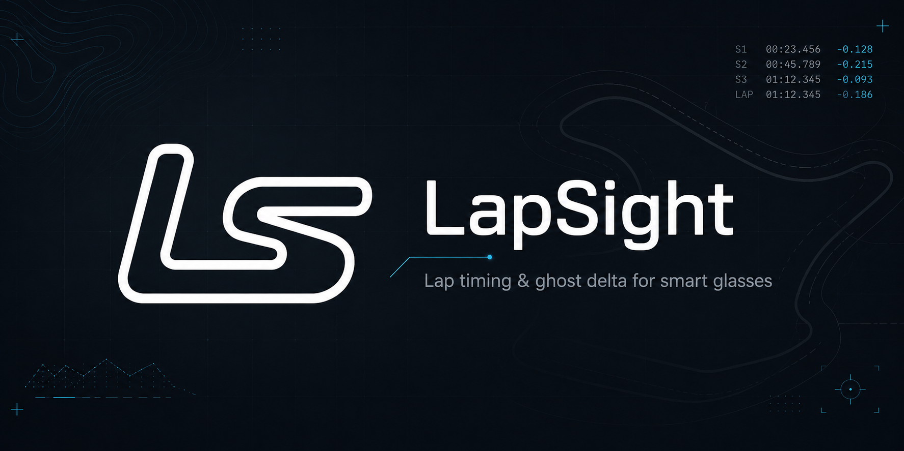
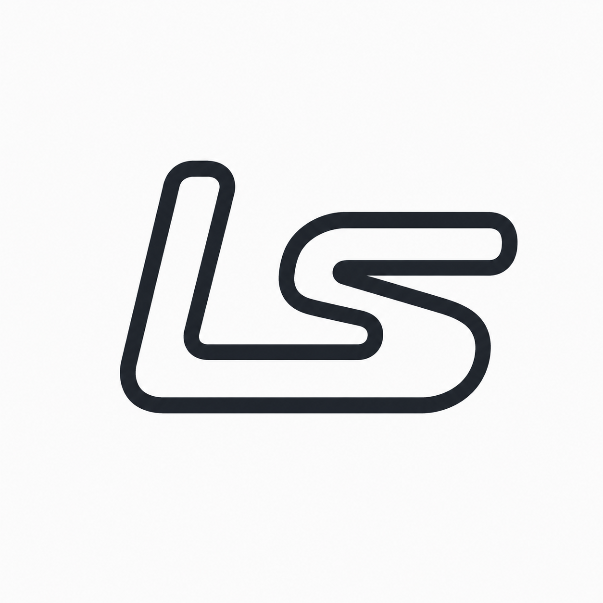

<div align="center">

[English](../README.md) | [中文](README_zh.md)

<br/>



<br/>

[](../.planning/STATE.md)
[](#)
[](#)
[](../LICENSE)

<br/>

### **LapSight 是一款专为卡丁车、赛道驾驶和自行车设计的、以手机为核心的单圈计时与幽灵车对比（Ghost-Delta）应用。**

*作为核心伴侣应用，手机端不仅是 GPS 采样、赛道配置、计时状态、录制保存、数据回放的数据源，未来还将对接 Meta 智能眼镜的 HUD 投射。*
*它的定位并非通用健身追踪器，而是一款专为封闭赛道和私人测试场地打造的**车载辅助计时仪器**。*

</div>

---

## 🏎️ 愿景

LapSight 不是一款普通的运动打卡工具。它是一款高精度的**车载计时设备**。
我们正在基于 Kotlin Multiplatform 从零构建一个纯净的共享单圈计时引擎，并结合了真实世界的遥测数据，同时保证算法的确定性与可测试回放能力。

---

## 🏎️ 当前状态

应用已经完成了第 5 阶段的赛道数据配置开发，并进入了 5.1 阶段（场地验证与稳定性测试）。Android 客户端已可运行，支持在真实手机 GPS 与模拟数据之间切换，并且已成功将 Android 融合定位服务 (Fused Location Provider) 接入到现有的共享定位接口中。

最新的本地 Android 版本已经成功安装并在通过 ADB 连接的 Pixel 10 Pro 上启动。剩余的 MVP 准入任务主要是真实场景路测证据：户外手机 GPS 验证、车载屏幕 UI 体验确认，以及最终的发布/打回修改/暂停 决策。

### ✨ 已实现功能
- **KMP 基础架构**: 跨平台的 Kotlin Multiplatform 共享领域逻辑，以及支持 Android/iOS 的 Compose Multiplatform 共享 UI。
- **单圈引擎**: 从零打造的计时引擎，包含起终点线判定、分段计时、单圈过滤器，以及确定性回放测试机制。
- **本地优先存储**: 赛道采样记录、V2 版本赛道配置、计时会话、幽灵参考圈和数据导出。
- **赛道设置流**: 闭环参考轨迹、起终点边界划定、分段设置、配置文件修订、复制/重命名/归档，以及错误路线起步前的预警。
- **车载驾驶模式 UI**: 支持横竖屏的计时界面布局、实时单圈状态、速度曲线、GPS 诊断、未完成会话恢复、以赛道为核心的准备屏幕，以及双面板的横屏驾驶舱设计。
- **幽灵车对比**: 基于完全匹配的赛道配置，提供幽灵圈以及与最佳成绩的实时差值计算（Delta-to-best）。
- **数据回顾 UI**: 按会话、赛道和原始采集记录分组；包含下钻详情页、圈数与分段表格、遥测图表与回放、轨迹渲染，以及 JSON/GPX 导出功能。
- **赛道渲染**: 详情与编辑器使用同一套经过美化的赛道地图渲染逻辑，无缝切换浏览与编辑模式。全屏下自适应横纵比、缩放至合适的赛道预览视图。
- **主题化系统**: 随系统自动切换/深色/浅色模式、单位切换及显示偏好设置，底层由共享的语义化主题及组件层驱动。
- **Android GPS 集成**: 融合定位服务（Fused Location Provider）的数据已映射到与模拟器相同的共享 `LocationSampleProvider` 及 `LocationSample` 模型中。集成了 Android 精确位置权限的运行时请求链路。

### 🚧 即将到来
- iOS Core Location 实时定位接入。
- 经过实地测试的 GPS 平滑处理与遥测数据质量调优。
- 外置高精度 GNSS 设备支持。
- Meta 智能眼镜 HUD 显示集成。

---

## 🏎️ 真实 GPS 状态

Android 目前已将 `AndroidFusedLocationSampleProvider` 注入到共享的 `LocationSampleProvider` 边界中，其行为和基于固定数据的模拟器完全一致。在驾驶和设置 UI 中，你可以在以下两种数据源间切换：

- 🛰️ **PhoneGps**: Android 融合定位服务的数据，需授予精确位置权限。
- 🧪 **Simulated**: 确定性的回放测试数据，用于回归测试、功能演示以及离线用户验收测试（UAT）。

这两种数据源都会产生相同的共享 `LocationSample` 数据模型，并携带显式的 `LocationSource` 来源标记，这使得在回顾记录时，应用能够清楚区分真实的手机 GPS 会话和模拟数据。

**剩余的真实 GPS 工作：**
- 在封闭赛道上验证户外手机 GPS 的表现，当前就绪标准为：水平误差小于 25 米，定位新鲜度 15 秒以内，最低采样频率 0.9 Hz。
- 根据真实录制的数据调整平滑算法和遥测质量阈值。
- 基于相同的共享接口实现 iOS Core Location 的定位服务提供者。
- 维持基于回放机制的测试框架，确保所有算法行为均可验证。

---

## 🏎️ 架构与项目结构

<div align="center">


</div>

```text
LapSight/
├─ androidApp/   Android 应用程序包、Manifest 文件及 Activity 入口
├─ iosApp/       Xcode 工程及 SwiftUI 界面入口
├─ shared/       共享的 KMP 领域逻辑、Compose UI、存储和测试
└─ .planning/    项目背景上下文、需求文档、路线图、阶段计划及开发状态
```

---

## 🏎️ 构建与测试

### Android Debug 构建

```powershell
.\gradlew.bat :androidApp:assembleDebug
```

安装到通过 USB 连接的 Android 设备：

```powershell
.\gradlew.bat :androidApp:installDebug
```

### 共享测试

```powershell
.\gradlew.bat :shared:testAndroidHostTest
```

最新进行全量本地验证的指令组合：

```powershell
.\gradlew.bat :shared:testAndroidHostTest :androidApp:assembleDebug
```

如果安装后 `adb` 未在环境变量 `PATH` 中，可用以下指令启动：

```powershell
& "$env:LOCALAPPDATA\Android\Sdk\platform-tools\adb.exe" shell monkey -p com.huanfuli.lapsight -c android.intent.category.LAUNCHER 1
```

### iOS

使用 macOS 上的 Xcode 打开 `iosApp/`，运行 `iosApp` 目标工程。iOS 的运行验证需要 macOS 以及模拟器或实体 iOS 设备。

---

## 🏎️ 开发笔记

- Android 构建需要配置 Android SDK，可以通过 `ANDROID_HOME`、`ANDROID_SDK_ROOT` 环境变量，或项目中的 `local.properties` 文件来指定。
- 共享的计时引擎必须与任何具体的 UI 及平台定位 API 完全解耦。
- 所有的算法行为都需要配合合成数据或回放记录数据进行测试覆盖。
- 本地设备截图、窗口布局 Dump、Logcat 日志文件、电子表格以及 `.planning/evidence/` 目录下的证据捕获等内容，均不应提交到 Git。

---

## 🏎️ 安全与定位声明

> [!WARNING]
> LapSight 的应用场景限定在封闭赛道、卡丁车场地、私人测试区域以及日常训练等上下文。**绝对不得被用作公共道路上的飙车计时工具。**

在移动过程中，应用应保持**被动响应状态**。用户应在车辆停止时配置好测试会话，并将手机安全固定。必须清楚，手机的 GPS 仅提供粗略的遥测参考，而非赛车级的高精度计时设备。

---

## 🏎️ 规划文档

- 📄 项目背景: `.planning/PROJECT.md`
- 📄 需求文档: `.planning/REQUIREMENTS.md`
- 📄 路线图: `.planning/ROADMAP.md`
- 📄 当前状态: `.planning/STATE.md`
- 📄 技术栈研究: `.planning/research/STACK.md`
- 📄 单圈引擎研究: `.planning/research/LAP_ENGINE.md`

---

## 📜 开源协议

本项目采用 GNU Affero General Public License v3.0 开源协议 - 详情请查看 [LICENSE](../LICENSE) 文件。

---

<div align="center">



<br/>

*Track your lines. Chase your ghosts.* 🏎️

</div>
